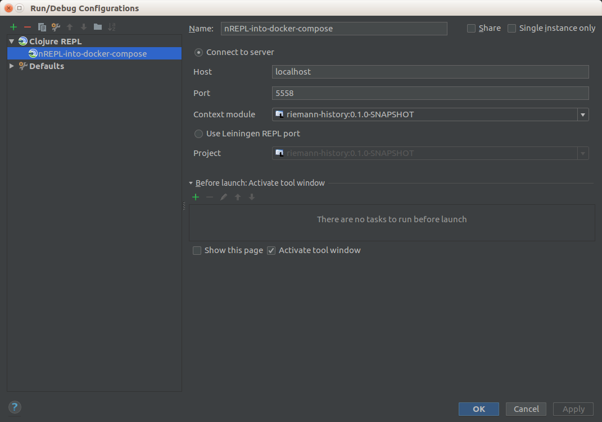

# riemann-history

A Riemann plugin called riemann-history

## Usage

### Build

```
lein uberjar
```

### run dev environment (Alpha)

``` 
for now there is no hot-code replacement: 
```

1) lein uberjar
1) docker-compose -f docker/compose.yml up
1) connect your repl using either 
    1) ```lein repl :connect 127.0.0.1:5558```
    1) 

### Add to classpath

```
export EXTRA_CLASSPATH=<path>/riemann/riemann-0.3.0/plugins/riemann-history-0.1.0-SNAPSHOT.jar
```

### Riemann example config

```
(load-plugins)

(require '[riemann-history.core :as history])

(logging/init {:file "/tmp/riemann.log"})

; Listen on the local interface over TCP (5555), UDP (5555), and websockets
; (5556)
(let [host "0.0.0.0"]
  (tcp-server {:host host
               :port 5555})
  (udp-server {:host host})
  (ws-server  {:host host}))

; Expire old events from the index every 5 seconds.
(periodically-expire 5)

(history/history {:connect "http://localhost:9200" 
                  :url "_search"
                  :interval 600
                  :query "/tmp/elasticsearch.json"}

(let [index (default :ttl 120 (index))]
  (streams
    (fn [e] (info @history/history-data))))
```

### Start riemann

```
./bin/riemann
```

### Example output

```
[...]
INFO [2018-06-19 11:58:24,963] Thread-6 - riemann.config - Called plugin with event service: riemann server ws 0.0.0.0:5556 in latency 0.99
INFO [2018-06-19 11:58:24,963] Thread-6 - riemann.config - Called plugin with event service: riemann server ws 0.0.0.0:5556 in latency 0.999
[...]
```

## License

Distributed under the Eclipse Public License, the same as Clojure.
